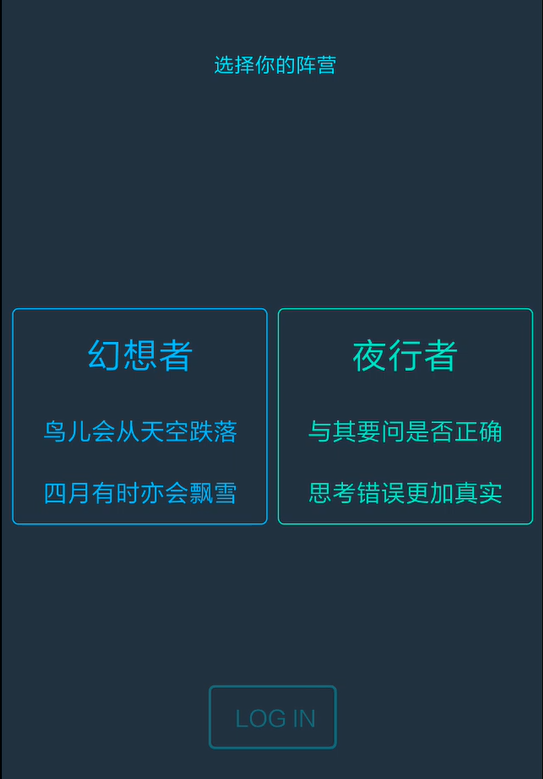
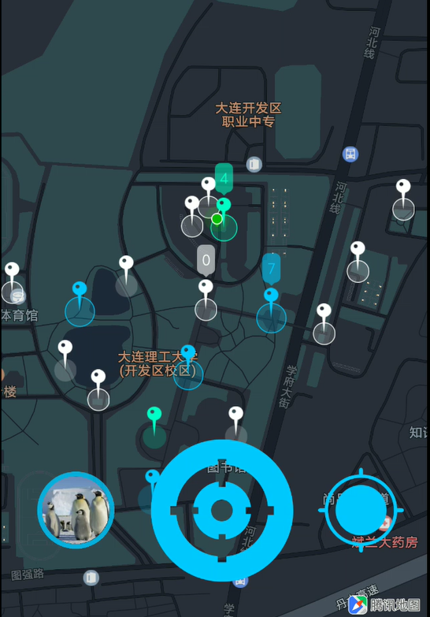
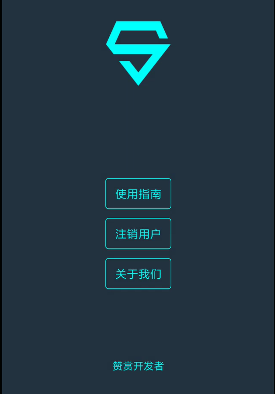

# SuperBeat
腾讯微信小程序大赛参赛作品  

登录界面

 
 

主界面

 
 

用户个人界面

 

## 项目介绍
### 需求分析
伴随着IT行业的日益火爆，越来越多的大学生选择攻读IT相关的专业。但由于专业的学习需要，很多学生终日面对电脑，缺乏锻炼，严重影响了身心健康。因此，该大学生群体亟需一种鼓励他们走出去运动的方式。 
针对这一现状，开发团队决定开发一款基于腾讯地图的户外实景体验微信小游戏。该游戏面向IT相关专业大学生以及平时缺乏锻炼的群体,让用户在体验趣味的同时锻炼身体，解决缺乏锻炼的问题。
### 玩法介绍
* 玩家初始选择蓝绿两种阵营中的一种，不同阵营之间进行竞技。每个阵营有若干据点。
* 玩家可以通过Beat的方式削弱对方阵营据点势力范围（势力范围通过人数体现），也可以增大自己阵营据点的势力范围。
* 最终，结算蓝绿双方在特定时间段内的势力范围，势力范围大的一方获胜。
### 更多
更多详细的项目介绍参见介绍文档。
## 效果展示
参见[演示视频](https://www.bilibili.com/video/av55038509/)(有bgm哦)。
## 项目开发
### 前端
前端部分代码详见前端文件夹。
### 后端
后端部分代码详见后端文件夹。后端部分说明参见后端/README.md。
## SuperBeat团队
* 曹子一
  * 项目的整体框架设计
  * 小程序端的代码编写和UI设计
* 王泽明(本人)
  * 后端SSM框架与数据库的维护
  * 后端代码编写。
* 白晨旭
  * 小程序后端核心计算功能的算法编写
  * 文档编写和PPT制作
## 联系我们
如有任何疑问或建议，可以通过邮箱wzm19971222@mail.dlut.edu.cn联系我们。
## 感谢
感谢曹子一和白晨旭对本项目的贡献。
